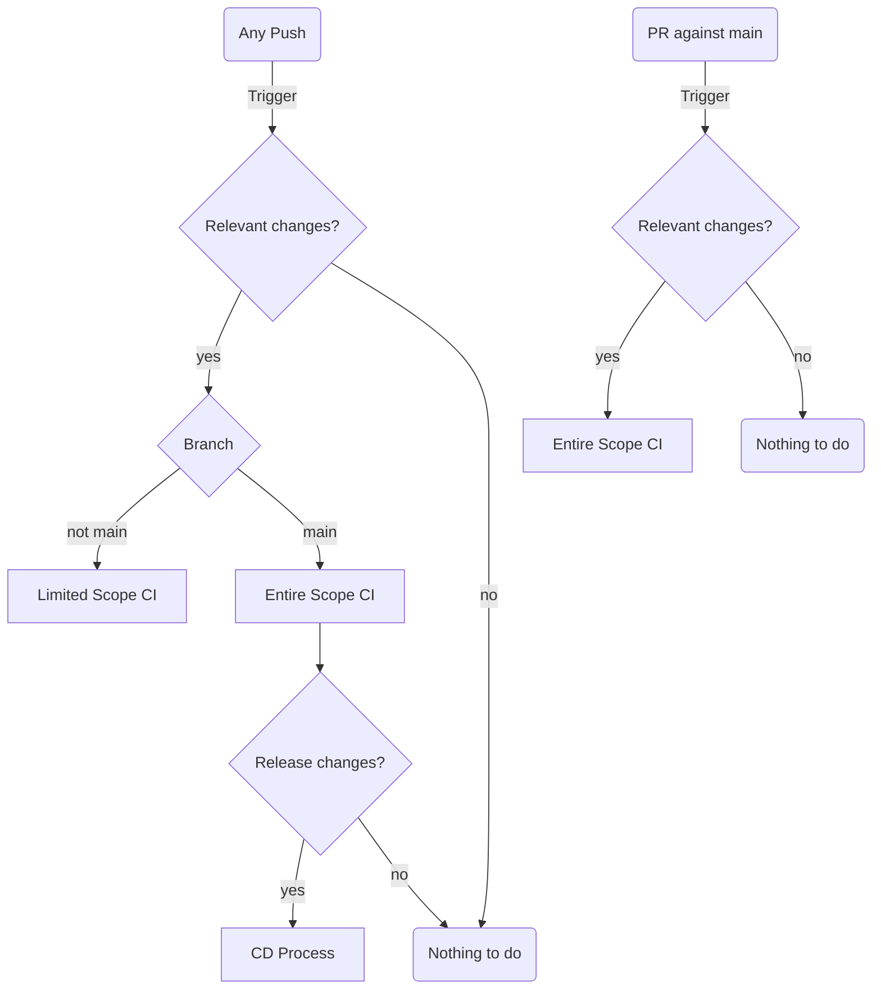

# CICD for orthogonal releases from one repository
`./github/workflows/` being a centralised location for any automated, testing, documenting, building, or releasing, coupled with this repo housing multiple orthogonal release targets (ideally one for each language included in it), leads to the obvious design goal of keeping any processes for a single language as clustered as possible, and that each overall process should attempt to maintain a uniformity as to "what it does" in terms of the testing, documenting, building, or releasing.
To achieve clustering for shared relevance to the same release target (per language) each workflow will be named `<language>-*.yaml`.
To achieve prescriptivity over the intended uniformity of each workflow as it pertains to "what it does" for (per that language's release target) each workflow will be named `<language>-<process>.yaml`.

Some restrictions that immediately apply to this, because it relies on [GitHub Actions](https://docs.github.com/en/actions) are related to the `workflow_call` event, and performing operations with the `GITHUB_TOKEN`.
While workflows are designed with the intent of being [modularisable / reusable](https://docs.github.com/en/enterprise-cloud@latest/actions/using-workflows/reusing-workflows#calling-a-reusable-workflow) via the [`workflow_call`](https://docs.github.com/en/enterprise-cloud@latest/actions/using-workflows/events-that-trigger-workflows#workflow_call) event, a workflow that is initiated via a `workflow_call` can not only not initiate another workflow via `workflow_call`, but even more than that cannot include an invocation to initiate another workflow via `workflow_call`, whether it runs or not! (It appears that the check for whether a chained `workflow_call` exists is shallow, and does not even parse the [`jobs.<job_id>.if`](https://docs.github.com/en/enterprise-cloud@latest/actions/using-workflows/workflow-syntax-for-github-actions#jobsjob_idif) to check if that chained invocation will be initiated) (the resulting error is `error parsing called workflow "./.github/workflows/some-workflow.yaml@": job "some-job" calls workflow "./.github/workflows/another-workflow.yaml@", but doing so would exceed the limit on called workflow depth of 2`). This is also coupled with the called workflow inheriting the entire "github context" from the callee, so a workflow with triggering actions `[<X>, workflow_call]` called by another workflow triggered by an `<X>` action, will pass the entire `<X>` context. For instance, a comparison can not be used such as `jobs.<job_id>.if: ${{ github.event_name == 'workflow_call' }}`, although the workflow call can bootstrap this condition with inputs.
Parallel to this is that any operation performed during an "action", if performed with the [`GITHUB_TOKEN`](https://docs.github.com/en/github-ae@latest/actions/security-guides/automatic-token-authentication) won't "trigger" any other workflows, regardless of if they are set up to only trigger on such an anticipated action, to minimise recursive workflow instantiations. The typical method to circumvent this is to utilise a "Personal Access Token" key to perform actions during a workflow that you do want to trigger another workflow, but this is looser security. All in all, both these issues with `workflow_call` and `GITHUB_TOKEN` make [GitHub Actions](https://docs.github.com/en/actions) feel very much like riding a bike with training wheels that can't be taken off.
# The "per that language's release target" processes
## CI
_Any_ push to _any_ branch, **that changes files relevant to** _some_ release target(s), should invoke a **"CI verification"** on that release.
* The steps within a **"CI verification"** can have either a _limited_ or _entire_ scope.
    * All release targets for the _entire_ scope should be included in the `jobs.<job_id>.strategy.matrix` such as;
        ```yaml
        jobs:
          <job_id>:
            runs-on: '${{ matrix.os }}'
            strategy:
            matrix:
              version: ['1', '2', '...']
              os: [ubuntu-latest, macOS-latest, windows-latest]
              arch: [x64, '...']
        ```
* The **"CI verification"** for a release **must** include a **full test suite**;
    * Which is equivalent to, or greater than, running a `make test` recipe.
* The **"CI verification"** for a release _may_ include a **documentation test**;
    * That **verifies an optional documentation generation** step in the post-release action will work.
    * Documentation testing can be within a unitary scope, according to how it will be hosted.
* _All_ pushes to, _and_ PRs against, _the **main**_ branch should invoke the **"CI verification"** across the _entire_ scope.
* _Any_ push to _any **non-main**_ branch should invoke the **"CI verification"** across the _limited_ scope.
    * i.e. no need to implement the **"CI verification"** across the _entire_ scope in `jobs.<job_id>.strategy.matrix`.
## CD
_All_ pushes to _the **main**_ branch **that changes files relevant to** _some_ release target(s), **_where those files affect the idiomatic versioning of that release_**, should, pending on the passing of the **"CI verification"**, invoke the **build and release** (**"CD actions"**) on that release target(s).
* The building, releasing, and or distributing process for each "release target" is unique, and the jargon used internally to each language, about its release, may be ambiguous in the absence of the context of that language. For this reason;
* A **release** step within the context of being an action in the CD workflow implies a ["github release"](https://docs.github.com/en/repositories/releasing-projects-on-github/about-releases).
    * The order of actions for a **release** should align with;
        * `{CI verification} => (build?) => release => (distribute?::(documentation?))`
    * A **release** may or may not contain **build artefacts**.
    * A **release** may or may not subsequently need to be "deployed"/"distributed"
## Workflow triggers

We want different processes for the workflows across four essential categories.
1. A push to main that changes the idiomatic release versioning.
    ```yaml
    on:
      push:
        branches:
        - 'main'
        paths:
        - 'some_lang/some_version_files'
    ```
    * Entire Scope CI
    * CD Process
1. A push to main that doesn't change the idiomatic release versioning.
    ```yaml
    on:
      push:
        branches:
        - 'main'
        paths:
        - 'some_lang/**'
        - '!some_lang/some_version_files'
        - '.github/workflows/some_lang-*'
    ```
    * Entire Scope CI
1. A push to any other branch
    ```yaml
    on:
      push:
        branches-ignore:
        - 'main'
        paths:
        - 'some_lang/**'
        - '.github/workflows/some_lang-*'
    ```
    * Limited Scope CI
1. A PR against main
    ```yaml
    on:
      pull_request:
        branches:
        - 'main'
        paths:
        - 'some_lang/**'
        - '.github/workflows/some_lang-*'
    ```
    * Entire Scope CI
## Templates for workflows; `*-test.yaml` and `*-build.yaml`
Can be search+replace'd on
* `<Language>` + `<language>` + `<language-emojis>`
* `<gh-action-setup-language@semver>` + `<language-version>`
* `<make-environment-dependencies>`
* `<version-file>` (appears as `export VERSION_FILE="<language>/<version-file>"`)
* `<version-extracting-command>` (appears as `export VER=$(<version-extracting-command>)`)

The caveat on the lowercase `<language>` is that it is replacing the value in `working-directory: <language>`, so is synonymous with the subfolder that contains that language, and might not always actually be replaced with something in lower case. It's also required that this uses the same capitalisation as the `.github/workflows/<language>-*` files.
## `<language>-test.yaml`
```yaml
name: <Language> <language-emojis> Tests 🦂
on:
  push:
    branches-ignore:
    - 'main'
    paths:
    - '<language>/**'
    - '!<language>/**.md'
    - '.github/workflows/<language>-*'
  pull_request:
    branches:
    - 'main'
    paths:
    - '<language>/**'
    - '!<language>/**.md'
    - '.github/workflows/<language>-*'
  workflow_call:
permissions: {}
defaults:
  run:
    shell: bash
    working-directory: <language>
jobs:
  quick-test:
    name: <Language> <language-emojis> Quick Test 🦂
    if: ${{ github.event_name == 'push' && !(github.event.ref == 'refs/heads/main') }}
    runs-on: ubuntu-latest
    steps:
    - name: 🏁 Checkout
      uses: actions/checkout@2541b1294d2704b0964813337f33b291d3f8596b # v3.0.2
    - name: <language-emojis> Set up <Language>
      uses: <gh-action-setup-language@semver>
      with:
        version: <language-version>
        arch: 'x64'
    - name: 🧱 Install build dependencies
      run: make <make-environment-dependencies>
    - name: 🦂 Test
      run: make test
  full-test:
    name: <Language> <language-emojis> Full Test 🦂
    if: >- 
      ${{ github.event_name == 'pull_request' || github.event_name == 'workflow_dispatch' ||
      (github.event_name == 'push' && github.event.ref == 'refs/heads/main') }}
    runs-on: '${{ matrix.os }}'
    strategy:
      fail-fast: false
      matrix:
        version: ['1', '2', '3']
        os: [ubuntu-latest] # , macOS-latest, windows-latest # < maybe.
        arch: [x64]
    steps:
    - name: 🏁 Checkout
      uses: actions/checkout@2541b1294d2704b0964813337f33b291d3f8596b # v3.0.2
    - name: <language-emojis> Set up <Language> ${{ matrix.version }}
      uses: <gh-action-setup-language@semver>
      with:
        version: ${{ matrix.version }}
        arch: ${{ matrix.arch }}
    # TODO: Maybe another step to install test dependencies
    - name: 🦂 Test
    # TODO: run: or uses: something depending on the languges
  # Docs step is optional depending on language
  # docs:
  #   name: <Language> <language-emojis> Docs 📄 Quick Test 🦂
  #   runs-on: ubuntu-latest
  #   steps:
  #   - name: 🏁 Checkout
  #     uses: actions/checkout@2541b1294d2704b0964813337f33b291d3f8596b # v3.0.2
  #   - name: <language-emojis> Set up <Language>
  #     uses: <gh-action-setup-language@semver>
  #     with:
  #       version: <language-version>
  #   - name: 📄 Docs
  #     run: make docs
```
## `<language>-build.yaml`
```yaml
name: <Language> <language-emojis> Test 🦂 Build 🧱 Release 🚰 and Publish 📦
on:
  push:
    branches:
    - 'main'
    paths:
    - '<language>/**'
    - '!<language>/**.md'
    - '.github/workflows/<language>-*'
  workflow_dispatch:
permissions: {}
defaults:
  run:
    shell: bash
    working-directory: <language>
jobs:
  context:
    name: GitHub 🐱‍👤 Context 📑
    uses: ./.github/workflows/github-context.yaml
  test:
    name: <Language> <language-emojis> Test 🦂
    uses: ./.github/workflows/<language>-test.yaml
  workflow-conditions:
    name: 🛑🛑🛑 Stop builds that didn't change the release version 🛑🛑🛑
    runs-on: ubuntu-latest
    outputs:
      version-file-changed: ${{ steps.version-file-check.outputs.version-file-changed }}
      version-tag-exists: ${{ steps.version-tag-exists.outputs.version-tag-exists }}
    steps:
    - name: 🏁 Checkout
      uses: actions/checkout@2541b1294d2704b0964813337f33b291d3f8596b # v3.0.2
      with:
        fetch-depth: 2
    - name: Check if version files changed
      id: version-file-check
      run: |
        export VERSION_FILE="<language>/<version-file>"
        [ "$(git diff HEAD^1.. --name-only | grep -e "^$VERSION_FILE$")" == "$VERSION_FILE" ] && echo "::set-output name=version-file-changed::${{toJSON(true)}}" || echo "::set-output name=version-file-changed::${{toJSON(false)}}"
    - name: Notify on version-file-check
      run: echo "::Notice::version-file-changed is ${{ fromJSON(steps.version-file-check.outputs.version-file-changed) }}"
    - name: Check if version specified in version file has not released.
      id: version-tag-exists
      run: |
        git fetch --tags
        export VER=$(<version-extracting-command>)
        [ -z "$(git tag -l "<language>-v$VER")" ] && echo "::set-output name=version-tag-exists::${{toJSON(false)}}" || echo "::set-output name=version-tag-exists::${{toJSON(true)}}"
    - name: Notify on version-tag-exists
      run: echo "::Notice::version-tag-exists is ${{ fromJSON(steps.version-tag-exists.outputs.version-tag-exists) }}"
  # Now any step that should only run on the version change can use
  # "needs: [workflow-conditions]" Which will yield the condition checks below.
  # We want to "release" automatically if "version-file-changed" is true on push
  # Or manually if workflow_dispatch. BOTH need "version-tag-exists" is false.
  build:
    name: <Language> <language-emojis> Build 🧱
    needs: [test, workflow-conditions]
    if: >-
      ${{ ((fromJSON(needs.workflow-conditions.outputs.version-file-changed) == true && github.event_name == 'push') ||
      github.event_name == 'workflow_dispatch') && fromJSON(needs.workflow-conditions.outputs.version-tag-exists) == false }}
    runs-on: ubuntu-latest
    steps:
    - name: 🏁 Checkout
      uses: actions/checkout@2541b1294d2704b0964813337f33b291d3f8596b # v3.0.2
    - name: <language-emojis> Set up <Language>
      uses: <gh-action-setup-language@semver>
      with:
        version: <language-version>
    - name: 🧱 Install build dependencies
      run: make <make-environment-dependencies>
    # Some step that uses `make build`
    # - name: 🆙 Upload dists
    #   uses: actions/upload-artifact@3cea5372237819ed00197afe530f5a7ea3e805c8 # v3.1.0
    #   with:
    #     name: some-artefacts
    #     path: <language>/some-artefacts/
    #     if-no-files-found: error
  release:
    name: <Language> <language-emojis> Release 🚰
    needs: [build]
    permissions:
      contents: write
    runs-on: ubuntu-latest
    steps:
    - name: 🏁 Checkout
      uses: actions/checkout@2541b1294d2704b0964813337f33b291d3f8596b # v3.0.2
    # - name: 🆒 Download dists
    #   uses: actions/download-artifact@fb598a63ae348fa914e94cd0ff38f362e927b741 # v3.0.0
    #   with:
    #     name: some-artefacts
    #     path: <language>/some-artefacts
    - name: 🚰 Release
      # env:
      #   GITHUB_TOKEN: ${{ secrets.GITHUB_TOKEN }}
      run: |
        export VER=$(some-version-obtaining-call)
        gh release create <language>-v$VER --generate-notes -t "<Language>: Version $VER"
  publish:
    name: <Language> <language-emojis> Publish 📦
    needs: [release]
    runs-on: ubuntu-latest
    steps:
    # Although the dists are built uses checkout to satisfy refs/tags existence
    # which were created by the release, prior to uploading to pypi.
    - name: 🏁 Checkout
      uses: actions/checkout@2541b1294d2704b0964813337f33b291d3f8596b # v3.0.2
    # - name: 🆒 Download dists
    #   uses: actions/download-artifact@fb598a63ae348fa914e94cd0ff38f362e927b741 # v3.0.0
    #   with:
    #     name: some-artefacts
    #     path: <language>/some-artefacts
    - name: 📦 Publish
    # TODO: run: or uses: something depending on the languges
  docs:
    name: <Language> <language-emojis> Docs 📄
    needs: [release, publish]
    permissions:
      contents: write
    runs-on: ubuntu-latest
    steps:
    - name: 🏁 Checkout
      uses: actions/checkout@2541b1294d2704b0964813337f33b291d3f8596b # v3.0.2
    - name: <language-emojis> Set up <Language>
      uses: <gh-action-setup-language@semver>
      with:
        version: <language-version>
    - name: 📄 Docs
      run: |
        export GITHUB_REF="refs/tags/v${{ needs.release-and-register.outputs.new_version }}"
        # make docs_deploy <<< should be a recipe that pushes docs to 'gh-pages-<language>'
      env:
        GITHUB_TOKEN: ${{ secrets.GITHUB_TOKEN }}
  docs-merge:
    name: GitHub 🐱‍👤 Pages 📄 Merger 🧬
    needs: [docs]
    permissions:
      contents: write
    uses: ./.github/workflows/github-pages.yaml
    with:
      merge_from: 'gh-pages-<language>'
```
# The meta-processes: `github-<metaprocess>.yaml`
## [`github-context.yaml`](https://github.com/Skenvy/Collatz/blob/main/.github/workflows/github-context.yaml)
Wraps echoing the [github context](https://docs.github.com/en/actions/learn-github-actions/contexts)
## [`github-pages.yaml`](https://github.com/Skenvy/Collatz/blob/main/.github/workflows/github-pages.yaml)
Unambiguously merges from some `gh-pages-*` branch into the `gh-pages` branch, with the assumed expectation that the `gh-pages-*` branch will be a `gh-pages-<language>` branch that only contains anything in a `<language>` subdirectory, and so only merge on top of its own previous merges.
